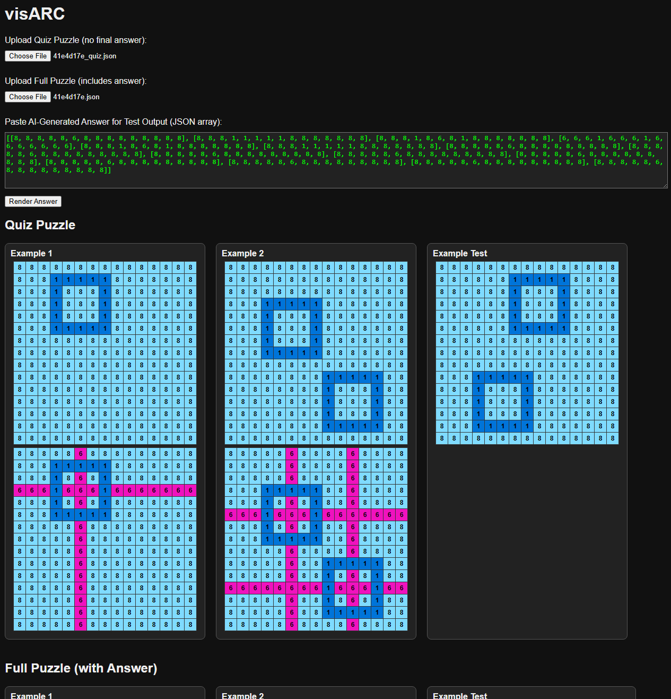
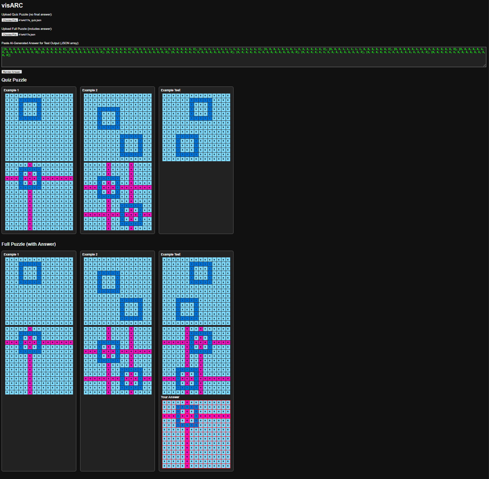

# visARC

ARC puzzle visualizer for verifying test integrity and comparing AI responses

---

## What it does
- Validates ARC quiz files against full puzzle datasets
- Visualizes AI model outputs in human-readable color grids with numbers
- Highlights mismatched grids between quiz/full and AI/actual answers
- Fully client-side – works offline or on GitHub Pages

---

## How to Use

1. Visit: [https://g4te-keep3r.github.io/visARC/](https://g4te-keep3r.github.io/visARC/)
2. Upload your ARC quiz JSON and/or full puzzle JSON files
3. (Optional) Paste AI-generated answer JSON to compare against correct solution

### Puzzle Files
Under sample_puzzles are 3 random selections from [ARC-AGI](https://github.com/fchollet/ARC-AGI/tree/master/data/training). Each is included in full and quiz form. Also included is a puzzle of my creation that has produced 11 different wrong answers acros ChatGPT and Claude with various models (GPT-5 and Opus 4.1 now included).

---

## Local Use

Open `index.html` in your browser. No setup needed.

---

## Example Usage

### Puzzle Rendering (with Color + Numbers)

Grids are rendered with **ARC-standard colors** and also display the **cell values** for easy debugging or annotation comparison.

### Full Layout + Answer Comparison

This example shows:
- **Quiz puzzle** (top) and **Full puzzle with test output** (bottom)
- **Submitted AI answer** (bottom-right)  
 - The red border highlights **a mismatch** between AI answer and correct answer

If any **training examples differ** between quiz and full files (aside from the quiz lacking a test output), they’ll also be shown with red outlines.

---

## TODO (other than a list of UX improvements)
- Add examples from https://arcprize.org/blog/arc-agi-2-technical-report - prob need to create jsons by hand
- Fuller explaination on the red grid with example of file integrity error
- This falls under UX improvements, but scaling NEEDS work

---

## License

[MIT](LICENSE)
